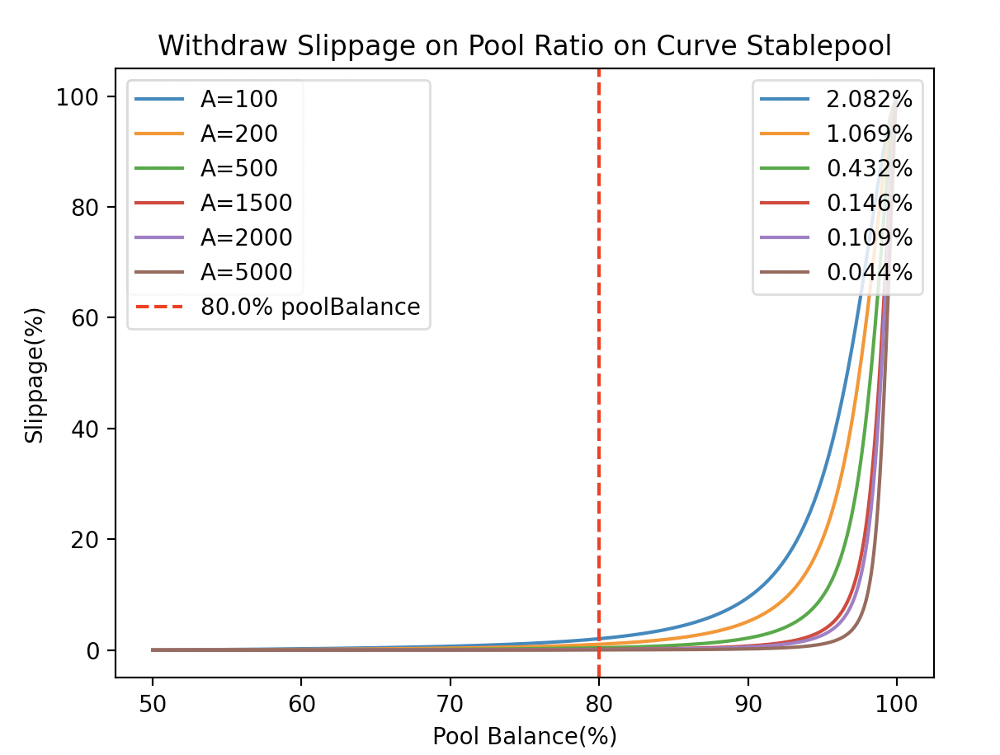
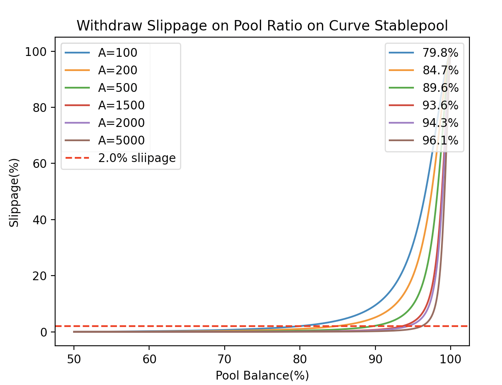
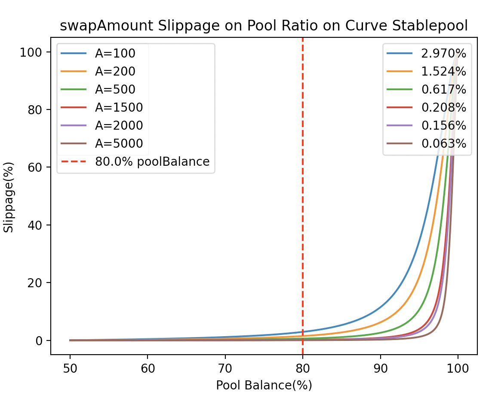

# Curve_Finance_Slippage_Simulator
simulate slippage for pool of various Amplifier(s), based on a targeted slippage(%) or a poolBalance(%)

## Install 
```
pip install -r requirements.txt
```

## Usage

### Simulate withdraw on a targeted PoolBalance(%)
```
# poolBalance 80%
python3 Withdraw.py -p 80
```



### Simulate withdraw on a targeted Slippage(%)
```
# Slippage 2%
python3 Withdraw.py -s 2
```



`Swap` can be simulated in the same fashion using `Swap.py`


### Simulate swap on a targeted PoolBalance(%)
```
# poolBalance 80%
python3 Swap.py -p 80
```



### Simulate swap on a targeted Slippage(%)
```
# Slippage 2%
python3 Swap.py -s 2
```

